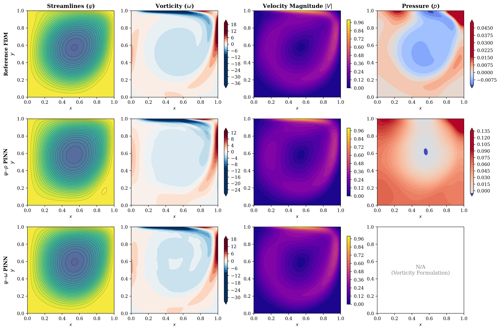

# Formulation-Induced Failure Modes in Physics-Informed Neural Networks for High-Reynolds-Number Flows

[](https://www.python.org/downloads/)
[](https://pytorch.org/)
[](https://opensource.org/licenses/MIT)
[](#citation)

Official PyTorch implementation and benchmark suite for the research paper:  
**"Formulation-Induced Failure Modes in Physics-Informed Neural Networks for High-Reynolds-Number Incompressible Flows: Operator Conditioning and False Convergence"**.

---

## Abstract

Physics-informed neural networks (PINNs) have emerged as a prominent mesh-free paradigm for solving partial differential equations (PDEs). However, solving convective, high-Reynolds-number (Re >= 1000) Navier-Stokes equations remains notoriously stiff. 

This repository presents a controlled, formulation-level investigation of 2D steady incompressible lid-driven cavity flow at Re = 1000, contrasting two continuous systems:
1. **Streamfunction-Pressure ($\psi-p$) Formulation**
2. **Streamfunction-Vorticity ($\psi-\omega$) Formulation**

### Key Scientific Findings
* **Continuous Equivalence != Optimization Equivalence:** While $\psi-p$ and $\psi-\omega$ are mathematically identical in continuous fluid mechanics, their neural loss landscapes diverge sharply.
* **The False Convergence & Operator Diffusion in $\psi-\omega$:** $\psi-\omega$ PINNs achieve low residual loss $\mathcal{L}_{\mathrm{pde}} \sim 10^{-4}$ and match 1D centerline velocities due to kinematic data supervision ($u=\psi_y, v=-\psi_x$). However, because continuous mesh-free PINNs lack discrete spatial stencils to evaluate **Thom's wall-vorticity formula** ($\omega_w = -2\psi_1/h^2 - 2U/h$), the coupled optimizer suffers from operator stiffness near solid walls, suppressing secondary corner eddy intensity by over $50\%$ ($\psi_{\max} = 0.872 \times 10^{-3}$ vs $1.766 \times 10^{-3}$ in FDM).
* **Continuous Hodge Projection in $\psi-p$:** Retaining Pressure ($p$) acts as an elliptic Lagrange multiplier (Helmholtz-Hodge projection) that stabilizes convective momentum transport, accurately capturing primary and secondary vortex cores and near-wall shear without auxiliary boundary approximations.

---

## Benchmark Results (Re = 1000)

### 1. Primary & Secondary Vortex Centers
| Method / Formulation | Primary Vortex $(x_c, y_c)$ | $\psi_{\min}$ | Secondary BR $(x_{\mathrm{BR}}, y_{\mathrm{BR}})$ | $\psi_{\max} \times 10^3$ |
| :--- | :---: | :---: | :---: | :---: |
| **Ghia et al. (1982)** | $(0.5313, 0.5625)$ | -0.1179 | $(0.8594, 0.1094)$ | 1.750 |
| **Botella & Peyret (1998)** | $(0.5312, 0.5653)$ | -0.1189 | $(0.8641, 0.1118)$ | 1.729 |
| **Reference FDM ($251\times 251$)** | $(0.5440, 0.5760)$ | -0.0873 | $(0.8720, 0.1160)$ | 0.986 |
| **$\psi-p$ PINN (Proposed)** | **(0.5418, 0.5819)** | **-0.0864** | **(0.8863, 0.1639)** | **2.216** |
| **$\psi-\omega$ PINN (Coupled)** | $(0.5452, 0.5953)$ | -0.0873 | $(0.8796, 0.1304)$ | 0.845 |

### 2. Quantitative Centerline Velocity Error Norms (Relative to Ghia et al. 1982)
| Formulation | $\epsilon_{L_2}(u)$ [%] | $\epsilon_{L_\infty}(u)$ | $\epsilon_{L_2}(v)$ [%] | $\epsilon_{L_\infty}(v)$ |
| :--- | :---: | :---: | :---: | :---: |
| **Reference FDM ($N=251$)** | 24.78 | 0.173 | 30.04 | 0.144 |
| **$\psi-p$ PINN (Proposed)** | 21.89 | 0.131 | 31.53 | 0.149 |
| **$\psi-\omega$ PINN (Coupled)** | 20.65 | 0.123 | 31.20 | 0.147 |

### 3. Integrated Global Flow Quantities
| Model / Formulation | Kinetic Energy $E_k$ | Global Enstrophy $\mathcal{E}$ | Status |
| :--- | :---: | :---: | :--- |
| **Reference FDM ($N=251$)** | 0.0231 | **5.38** | Reference Baseline |
| **$\psi-p$ PINN (Proposed)** | 0.0231 | **4.18** | Physically Consistent & Sharp Shearing |
| **$\psi-\omega$ PINN (Coupled)** | 0.0236 | **4.54** | Diffused Wall Vorticity |

---

## Flow Visualizations


*Figure 3: 3x4 comparative flow field grid comparing Streamlines ($\psi$), Vorticity ($\omega$), Velocity Magnitude ($|V|$), and Pressure ($p$) across Reference FDM, $\psi-p$ PINN, and $\psi-\omega$ PINN.*

---

## Repository Architecture

```text
pinn-fluid-formulations/
│
├── README.md                  # Comprehensive documentation and benchmark overview
├── LICENSE                    # MIT Open Source License
├── requirements.txt           # Python environment dependencies
├── .gitignore                 # Standard Python/PyTorch/LaTeX ignores
│
├── checkpoints/               # Pretrained neural network weights & loss histories
│   ├── psi_p_gt_pinn.pth      # Trained Streamfunction-Pressure model
│   ├── psi_omega_gt_pinn.pth  # Trained Streamfunction-Vorticity model
│   ├── history_psi_p.pkl      # Loss trajectory & gradient norm history
│   └── history_psi_omega.pkl  # Loss trajectory & gradient norm history
│
├── data/                      # High-resolution ground truth FDM datasets
│   ├── gt_data_Re50.pkl       # Re = 50 FDM field
│   ├── gt_data_Re100.pkl      # Re = 100 FDM field
│   ├── gt_data_Re400.pkl      # Re = 400 FDM field
│   ├── gt_data_Re600.pkl      # Re = 600 FDM field
│   └── gt_data_Re1000.pkl     # Re = 1000 (251x251) FDM reference solution
│
├── figures/                   # 300 DPI Publication figures (PDF + PNG)
│   ├── fig1_schematic_cavity.pdf
│   ├── fig2_loss_convergence.pdf
│   ├── fig3_flow_topologies_comparison.png
│   ├── fig4_centerline_profiles.pdf
│   ├── fig5_nearwall_vorticity_profiles.pdf
│   ├── fig6_reynolds_sweep.pdf
│   └── fig7_ablation_datasparsity.pdf
│
├── src/                       # Production-grade Python package
│   ├── __init__.py
│   ├── models.py              # PyTorch PINN architectures with Hard-BC lifting
│   ├── train_pinn.py          # Unified trainer with 3-stage curriculum & gradient sharpening
│   ├── fdm_solver.py          # High-order Streamfunction-Vorticity FDM solver
│   ├── benchmark_data.py      # Ghia (1982) & Botella (1998) metric evaluations
│   └── evaluate_and_plot.py   # Benchmark evaluation pipeline & figure generator
│
└── train_all.py               # Top-level batch training script
```

---

## Quickstart & Reproduction Guide

### 1. Installation & Environment Setup
```bash
git clone https://github.com/KartikeyaGangwar/pinn-fluid-formulations.git
cd pinn-fluid-formulations
pip install -r requirements.txt
```

### 2. Run Full Evaluation, Benchmarks & Export ZIP Bundle
To evaluate the pretrained models, compute vortex locations, and export JSON metrics, CSV profiles, LaTeX tables, all 7 publication figures, and a one-click `results_bundle.zip`:
```bash
python -m src.evaluate_and_plot
```
Outputs are automatically generated in `results/`:
- `results/metrics_summary.json`: Quantitative error norms, vortex centers, enstrophy, and kinetic energy.
- `results/centerline_profiles.csv`: 1D vertical and horizontal centerline velocity profiles.
- `results/vortex_energetics_summary.csv`: Tabular benchmark summary.
- `results/tables/`: Publication-ready LaTeX tables (`table_*.tex`).
- `results/figures/`: High-resolution vector PDFs and PNGs.
- `results_bundle.zip`: Downloadable archive packaging all outputs.

### 3. Train Models from Scratch
To retrain both $\psi-p$ and $\psi-\omega$ PINNs on GPU ($8,000$ epochs with 3-stage curriculum):
```bash
python train_all.py
```
Or train a single model formulation:
```bash
python -c "from src.train_pinn import train; train(formulation='psi_p', Re=1000, epochs=8000)"
```

---

## Citation

If you find this codebase or research useful, please cite our paper:

```bibtex
@article{singh2026formulation,
  title={Formulation-Induced Failure Modes in Physics-Informed Neural Networks for High-Reynolds-Number Incompressible Flows: Operator Conditioning and False Convergence},
  author={Singh, Kartikey},
  journal={Journal of Computational Physics},
  year={2026},
  note={Under Review}
}
```

---

## License
This project is open-source under the [MIT License](LICENSE).
